# Frequently Asked Questions





| Problem | Try This |
| --- | --- |
| Installing Git - (if your lab computer does not have git installed) | Run this on the terminal: <br> <code>winget install --id Git.Git -e --source winget</code> <br>Note: You will need to restart VS code if it was running before you installed git (or restart the terminal) so windows can find the installed version of git. |
| Java tests do not appear, or the main class does not load or run. | Run **Clean Java Server Workspace**:<br><br>1. Press <code>CTRL+SHIFT+P</code>.<br>2. Enter <code>clean java server workspace</code>.<br>3. Select **Reload &amp; Delete**.<br>4. Repeat the process if necessary.<br>5. If you are using Codespaces, remove the temporary files by running <code>sudo rm -rf /tmp/\*</code>. |
| Java FX codespaces loading in recovery mode? | See how to disable the sound drivers from loading here. |
| Java FX won't run on codespaces: `Error: JavaFX runtime components are missing, and are required to run this application` | Open up and look at the file: *`.vscode/launch.json`* It's likely you have changed or created a different app that is missing the "linux" section that is needed to find the java fx libraries. Copy that section over to your current configuration so it can find the libraries again. You can usually tell if you see a "projectname" section that is not set to an empty string project name. You can safely delete this launch configuration and use the original one I set up for you instead. **"linux": { "vmArgs": "--module-path ...** |
| Codespaces shows error running the UI port window (x -Failed To Connect To Server) | Try "SHIFT-REFRESH" in your browser window for the VNC UI port. This will delete all cached data in the browser window and seems to fix this problem. |
| I don't know how to use Git/GitHub | There are video tutorials [here](https://www.youtube.com/playlist?list=PLRqwX-V7Uu6ZF9C0YMKuns9sLDzK6zoiV) and we also have a set of tutorials hosted at the NCHS website [here](https://nchs-cs.github.io/idp/static/gitbranching/learnGitBranching/) |
| I am confused about codespaces | GitHub codespaces directions are [here](https://docs.github.com/en/codespaces/developing-in-a-codespace/developing-in-a-codespace). NCHS specific directions and help are in this doc below [here](https://docs.google.com/document/d/1_pbLhVmvnMzIhO-ja_HQkc8UjtaZ4OkBJi2YwU3Vpf0/edit?pli=1&tab=t.0). |
| Running Java UI from VS Code results in X11 display issue | This results from clicking to open the project directly to VS code with the "Open in VS code" from the classroom. (It's trying to run codespaces remotely but this doesn't work for Swing). Instead clone the repository from VS Code (create a new window and select to clone a repository and use the link for your github repository from GitHub to clone it). This will then run as expected in your local VS code. Alternatively run remotely and follow directions below for running in CodeSpaces. |
| GitHub complains you don't have user.name or user.email | `git config --global user.name "Your name"` <br> `git config --global user.email <id>@apps.nsd.org` |
| If you have an ssl issue in vscode saving your work | `git config --global http.sslVerify false` |
| When trying to clone a repository to a local machine: "SSL certificate problem: self-signed certificate in certificate chain" | If you are on Windows: enter this on the terminal to configure ssl correctly <br> `git config --global http.sslbackend schannel` <br> On linux/codespaces: <br> `git config --global http.sslbackend openssl` |
| "Sync" fails / conflict (when trying to submit) | Enter this into the terminal and sync again: <br> `git config set pull.rebase true` |
| "Commit" looks it's taking forever | Make sure you don't have the "COMMIT_MSG" file up and waiting for you to edit and close. Just close it and put your commit message in above the commit button. |
| Other random codespace error or message of something weird (aka rebuild codespace) | **Warning this will lose any changes you haven't pushed to your github repo** <br> Enter Ctrl-Shift-P for the command palette, type "Reb…" to get "Codespaces: Rebuild Container", select "Full Rebuild". |
| Trying to run java main isn't working (e.g. main is not found or perhaps the java run/play button is missing) | Check you have enabled the Microsoft java extension pack and not the oracle one. <br> This is correct: <br> 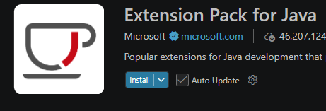 <br> This doesn't fully support VS code use: <br> 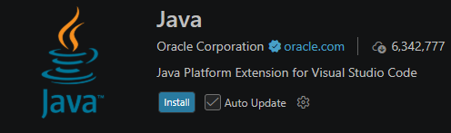 |





## Markdown

Markdown syntax allows rich formatting in documents using any plain text editor.

### Basic Markdown Guide

Here is a basic markdown guide: [markdownguide.org](https://www.markdownguide.org/basic-syntax/)

### Integrating with Google Docs

You may upload and download markdown documents to Google Docs. To edit a markdown document in Google Docs, upload the document and then edit in Google Docs.

Note you must use the Google Drive "upload" feature or from Google Docs you can select **File → Open** to directly open the markdown document (this is the easiest way).

Whenever you want to save the current version of the document choose **File → Download → Markdown**.

**Warning**: If you include images in your Google documents these will be encoded in the markdown content. It's often better to just edit the markdown document directly instead of using Google Docs if you make heavy use of images that you may modify and replace so you can reference these with markdown links to image files.





## Signing up for GitHub

It's recommended that you create a "school" github account. To do this you can use your google SSO (single sign on) and you should create your account username with the following credentials using "firstname-lastname" for your username. **Do not enable 2 factor authentication** as this will cause you to need to use your phone or other device when you sign in.

## GitHub Education Accounts

If you run out of time in GitHub codespaces apply for a free GitHub education account. Here's how to do that:

You can request an education account [here](https://github.com/settings/education/benefits) which will take you to your settings for your github account to start the application process.

Do not put in any billing information. Make sure to select that you are a student. You may need to turn on two factor authentication and verify your email address. Make sure to set two factor to use your email address so you can still reset and access your account in school without your phone. **Do not set two-factor** to your phone number as it disrupts class to have to use your phone for two factor authentication.

You need proof that you are a student so you'll need to edit and print the following document for you to use during the signup process (I'll need to sign it for you too): [Google Doc Link](https://docs.google.com/document/d/1vyFcQCQlhnSlcZG_f_q3uXCPplXpojHtnhs67t94Pok/edit?usp=sharing).

### Committing and Pushing Changes

1. **Stage changes**: In the Source Control view (left sidebar), you'll see a list of changed files. Click the '+' icon next to each file you want to commit.
2. **Commit changes**: Type a commit message describing your changes, then click the checkmark icon to commit.
3. **Push changes**: Click the "Sync Changes" button to push your commits back to GitHub.

### Following Classwork in GitHub

In order for students to follow along with code-alongs on larger projects we are going to adopt the following workflow.

Students can do work in their workspace using their "main" branch of their code saved to their computer or codespace.

The easiest way for students to track these separately is to clone their GitHub repository for the "Classwork" repository to a different folder on their local computer. They can cut/copy the code from here into their ongoing project if they miss work or want to compare their work with the classwork.

**NOTE**: It's very easy to confuse work between the two. If you are getting an error that you can't write/sync your work, check first to make sure you are actually doing the work in your own repository vs trying to send updates to our class project (which you can't).





## Remove Redundant Launch Configurations

Every time you hit the "play" button on a java file VS code creates a new project name specific to the computer you are on. You get a message that the project name is not a valid project if you try and run the configuration from Run and Debug too:

(Insert photo here)

Edit your launch.json and simply remove the **projectName** setting; it's not necessary.

## Coding Style Guidelines

As we dive into Java development, we will be adhering to the [Google Java Style Guide](https://google.github.io/styleguide/javaguide.html). We could have picked guidelines from other large companies to follow but this one was the most popular in the search results right now. This guide isn't just about making code "look pretty"; it is an industry standard for creating professional, maintainable, and readable software. By following these rules, you ensure that your code is "in Style," covering everything from naming conventions to how we handle braces and imports.

### Why Use a Coding Guide?

If you're wondering why we don't just let everyone code their own way, here are five key reasons:

- **Readability**: Code is read much more often than it is written. A consistent style allows team members (and your instructors) to understand your logic at a glance without being distracted by unusual formatting.
- **Maintainability**: Standardized code is easier to debug and update. When everyone follows the same rules, "ownership" of the code shifts from the individual to the team.
- **Reduced Cognitive Load**: You shouldn't have to spend brainpower deciding where to put a curly brace. A style guide makes these decisions for you, letting you focus entirely on solving the actual problem.
- **Error Prevention**: Rules like always using braces for if and else blocks help prevent common logic bugs that occur when code is modified later.
- **Professionalism**: Learning to follow a style guide prepares you for the real world. Almost every major tech company enforces a specific style to ensure high-quality software across thousands of developers.

### Tooling: Automated Formatting

To make following these rules effortless, we will use an automated formatter. This ensures your code is corrected every time you save.

#### Install the Extension

1. Open **VS Code**.
2. Go to the **Extensions** view (click the square icon on the left or press `Ctrl+Shift+X`)
3. Search for and install: `josevseb.google-java-format-for-vs-code`.

#### Configure Settings

To ensure the extension works correctly, update your workspace settings. Create or open the `.vscode/settings.json` file in your project folder and add the following configuration to the existing configuration there.

```json
{
  "java.format.settings.url": "https://raw.githubusercontent.com/google/styleguide/gh-pages/eclipse-java-google-style.xml",
  "java.format.settings.profile": "GoogleStyle",
  "[java]": {
    "editor.defaultFormatter": "josevseb.google-java-format-for-vs-code",
    "editor.formatOnSave": true,
    "editor.insertSpaces": true,
    "editor.tabSize": 2
  }
}
```

### Applying Style to an Existing Project

If you already have a project full of code, you will need to open every file manually to fix the formatting. Open each file and save the file to trigger an update in formatting.

#### Commit the Changes

Once the formatter has touched your files, your Source Control tab will show several modified files. To keep your history clean, commit these as a single "style update":

1. Go to the **Source Control** tab (the branch icon on the left).
2. Stage all changes by clicking the **+** (plus) icon next to "Changes".
3. In the message box, type: `style: apply google-java-format to project`
4. Click **Commit**.

By committing formatting changes separately from logic changes, you make it much easier for others to review your "real" code work later!

## Running Java Apps Standalone (jar files)

### Create your JAR

1. Go to visual studio
2. Press `CTRL+SHIFT+P`
3. Type "export jar"
4. Select your "Main" class (whatever your main is in)

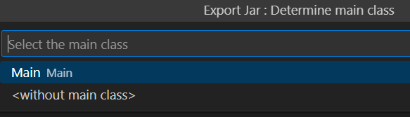

Your "jar" file is created in your root folder

You shouldn't need add additional javafx libraries to your jar files for other students to be able to run it because we have the Zulu FX SDK installed on school computers to support all the FX libraries.

### Test your JAR

#### If you are using codespaces

Download from codespaces to your local computer and run the jar from there.

#### If you are using visual studio

**NOTE**: To test you should copy your jar file to a different location (otherwise it still has access to your other files, which it won't when you copy and share it).

### Run a JAR file

Test out running it with these steps to run someone else's "jar" file:

1. Go to the command prompt: (You can right click in explorer and select to Open in Terminal)
2. Type `java -jar <filename.jar>`

For example:
```
java -jar myfungame.jar
```

### Common Gotchas

**NOTE**: You need to change image reading (or any other "file" access) to the following API instead:

```java
BufferedImage img = ImageIO.read(getClass().getResourceAsStream("/path/img.png"));
```

You can't use exists or other direct File access (except for things like save game files etc that you truly want as files on the destination computer).

## How to Create and View Javadocs

Javadocs are required for most homework assignments. They are an industry standard practice for Java coding and often at most companies you will be required to have sufficient Javadoc commenting in place for the work you do to be accepted. So for this course we will make sure we get into the practice of always creating our javadocs for each project.

### Commenting your Code for Javadoc

The first step you must take is to include javadoc comments in your code. A javadoc comment begins with `/**` and ends with `*/`. At a minimum your javadoc comments should include a description of each method, the parameters (@params) and any return parameter (@return) described - typically with a single line comment. You may use html markup such as `<a>` or `<p>` tags in the example below, but is not required. The items in bold below are required for most comments. It's not required to comment more details than necessary (e.g. for a getter or setter, the function is obvious so often you may skip the description).

```java
/**
 * Returns an Image object that can then be painted on the screen.
 * The url argument must specify an absolute {@link URL}.
 * The name argument is a specifier that is relative to the url argument.
 * <p>
 * This method always returns immediately, whether or not the
 * image exists. When this applet attempts to draw the image on
 * the screen, the data will be loaded. The graphics primitives
 * that draw the image will incrementally paint on the screen.
 *
 * @param url an absolute URL giving the base location of the image
 * @param name the location of the image, relative to the url argument
 * @return the image at the specified URL
 * @throws Exception any exception that may be thrown by this method
 */
```

See this [guide](https://www3.cs.stonybrook.edu/~cse214/Javadoc.htm) for a beginners guide to the documentation on javadoc parameters and [the full javadoc 23 specification](https://docs.oracle.com/en/java/javase/23/javadoc/).

### VS Code Tools to Help

You may install VS Code tools to help with your documentation. The javadoc tool helps you out by putting javadoc comments (stubs) for your public methods - you'll still need to fill in the details of the methods.

#### Building the Javadocs

**Standard Java**

**Note**: This will not work for Java FX projects (see section below)

To build javadocs you must run a command to export/create the javadoc html files from your comments. The best way to create your javadocs is just to run the javadoc command on the terminal/command line directly like this (Note; you must be in the parent directory of all of your java files)

**For linux/codespaces:**
```bash
javadoc -d docs $(find . -name "*.java")
```

**For windows/VS Code:**
```powershell
javadoc -d docs (Get-ChildItem -Recurse -Filter *.java).FullName
```

This will likely generate a number of errors/warnings. You should go through these and fix as many as you can to make sure you've fully commented on your project.

**Java FX**

For Java FX we have set up a build task to create javadocs on most projects. You can run the task to build your javadocs with `CTRL-SHIFT-B` or `CTRL-P` + "Run Build Task" (this is only set up for our specific github classroom assignment). After running you should see a docs folder.

#### Downloading and Viewing the Javadocs

**From VS Code/Codespaces:**
Install the following extension

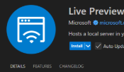

After you install an HTML preview extension you can right click on the `docs/index.html` file and "Open Preview". Note that in codespaces you will need to reload the window for it to work the first time.
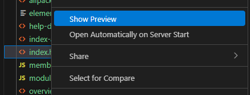

**For codespaces**: You may also download the files from your codespace to your local computer. Right click on the "docs" folder and select to download that directory. You'll get all the files downloaded locally (likely to your "Downloads" folder). You don't need to do this if you are working in windows locally with VS code.

Once you have the files on your computer you can view the files locally. Find the location of your index.html file by right clicking on the file in the toolbar and selecting "Show in Explorer" (Or if you downloaded the files just find them directly). From there you can just double click the **index.html** file to open the javadoc content → confirm that all your expected comments show up including the class comments and public method comments.

## PMD

https://pmd.github.io/

### About PMD

PMD is an extensible multilanguage static code analyzer. It finds common programming flaws like unused variables, empty catch blocks, unnecessary object creation, and so forth. It's mainly concerned with Java and Apex, but supports 16 other languages. It comes with 400+ built-in rules. It can be extended with custom rules. It uses JavaCC and Antlr to parse source files into abstract syntax trees (AST) and runs rules against them to find violations. Rules can be written in Java or using a XPath query.

Currently, PMD supports Java, JavaScript, Salesforce.com Apex and Visualforce, Kotlin, Swift, Modelica, PL/SQL, Apache Velocity, JSP, WSDL, Maven POM, HTML, XML and XSL. Scala is supported, but there are currently no Scala rules available.

Additionally, it includes CPD, the copy-paste-detector. CPD finds duplicated code in many languages including C, C++, C#, Java, JavaScript, Kotlin, Python, Ruby, and others.

### Main PMD Issues

Following are the main metrics that I use to assess class design and modularity. I do look at other metrics as well but these are the main ones that would affect your grade the most.

| Metric | Why it matters for your Rubric |
| --- | --- |
| `GodClass` | **Critical**. This is the #1 enemy of modularity. A "God Class" knows and does too much. If this number is anything above 0, you have a class that violates the Single Responsibility Principle. Fix this first. |
| `CyclomaticComplexity` | **Stability**. This measures how many paths exist through your code. High numbers = "spaghetti code" that is impossible to unit test effectively. This directly tanks your stability score. |
| `TooManyMethods` | **Modularity**. If a class has too many methods, it's not modular—it's bloated. This is often a symptom of failing to break a class down into smaller, focused helpers. |
| `DataClass` | **Design**. A Data Class is just a container for data with no real behavior (just getters/setters). In good OOD, objects should do things, not just hold things. |

### Rules Configuration

Here are the rules I am using in 2025 for reviewing the final projects:

```xml
<?xml version="1.0"?>
<ruleset name="Custom PMD Rules" xmlns="http://pmd.sourceforge.net/ruleset/2.0.0"
         xmlns:xsi="http://www.w3.org/2001/XMLSchema-instance"
         xsi:schemaLocation="http://pmd.sourceforge.net/ruleset/2.0.0 https://pmd.sourceforge.io/ruleset_2_0_0.xsd">

    <description>
        Custom ruleset for code metrics and Javadoc checks
    </description>

    <rule ref="category/java/design.xml/NPathComplexity"/>
    <rule ref="category/java/design.xml/CyclomaticComplexity"/>
    <rule ref="category/java/design.xml/TooManyFields"/>
    <rule ref="category/java/design.xml/TooManyMethods"/>
    <rule ref="category/java/design.xml/GodClass"/>
    <rule ref="category/java/design.xml/DataClass"/>

    <!-- Documentation rules for Javadoc comments -->
    <rule ref="category/java/documentation.xml/CommentRequired">
        <properties>
            <property name="classCommentRequirement" value="required"/>
            <property name="fieldCommentRequirement" value="ignored"/>
            <property name="protectedMethodCommentRequirement" value="ignored"/>
            <!-- This is set required in grading but is for teacher info only -->
            <property name="publicMethodCommentRequirement" value="required"/>
        </properties>
    </rule>
</ruleset>
```

[Download this file: rules.xml](https://github.com/NCHS-CS/nchs-cs.github.io/raw/main/faq.md)

### How to Run at School

1. Save the above rules.xml file to your project.

2. Download and extract the PMD files for windows to your computer (the rules above are using PMD version 7.24.0 but later versions should work too). You must use the following **powershell** for this download and it saves your files to your Downloads folder.

```powershell
Invoke-WebRequest -Uri https://github.com/pmd/pmd/releases/download/pmd_releases%2F7.24.0/pmd-dist-7.24.0-bin.zip -OutFile $env:USERPROFILE\Downloads\pmd.zip
```

3. Now run the following example command (note you'll need to replace the path for where your unzipped pmd is). You'll need to run this from a command prompt (not powershell) otherwise the window will come up and disappear immediately.

```bash
# Run from your project folder
"C:\Users\jrukman\Downloads\pmd\pmd-bin-7.24.0\bin\pmd" check -d .\src\main -R rules.xml -r pmd_results.txt
```





## Java FX - Installing on Another Computer

Download and install the Zulu FX Java FX SDK from [here](https://www.azul.com/downloads/?package=jdk-fx#zulu). Be sure to scroll down and select the Java FX SDK, not the default SDK. You can install the latest (v25) at this time.

**For windows**: use the "msi" file. Be sure to set the "JAVA_HOME" environment parameter during the install.

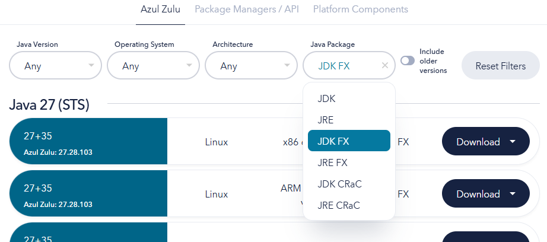

## Java FX - Missing Libraries

When trying to build you may find that VS code cannot locate the FX libraries. You'll need to point your visual studio to where the FX libraries are located.

Add the following to your `.vscode/launch.json` (add a new line right after projectname):

```json
"vmArgs": "--module-path \"${env:JAVA_HOME}\\lib\" --add-modules=javafx.controls,javafx.fxml --enable-native-access=javafx.graphics"
```

Or in your user settings (JSON):

```json
"java.debug.settings.vmArgs": "--enable-native-access=javafx.graphics --sun-misc-unsafe-memory-access=allow --module-path \"${env:JAVA_HOME}\\lib\" --add-modules=javafx.controls,javafx.fxml"
```

### Suppressing JavaFX Warnings

To suppress the following warnings:

```
WARNING: A restricted method in java.lang.System has been called
WARNING: java.lang.System::load has been called by com.sun.glass.utils.NativeLibLoader in module javafx.graphics (jrt:/javafx.graphics)
WARNING: Use --enable-native-access=javafx.graphics to avoid a warning for callers in this module
WARNING: Restricted methods will be blocked in a future release unless native access is enabled

WARNING: A terminally deprecated method in sun.misc.Unsafe has been called
WARNING: sun.misc.Unsafe::allocateMemory has been called by com.sun.marlin.OffHeapArray (jrt:/javafx.graphics)
WARNING: Please consider reporting this to the maintainers of class com.sun.marlin.OffHeapArray
WARNING: sun.misc.Unsafe::allocateMemory will be removed in a future release
```

Add this line to your user settings.json (`CTRL-SHIFT-P` → User Settings (JSON)):

```json
"java.debug.settings.vmArgs": "--enable-native-access=javafx.graphics --sun-misc-unsafe-memory-access=allow"
```

Or open User Settings (UI) and search for vmargs and add:

```
--enable-native-access=javafx.graphics --sun-misc-unsafe-memory-access=allow
```
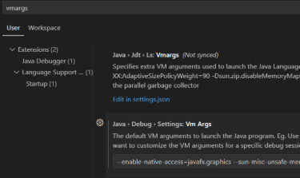





## Codespace Usage

**Note: GitHub as of 08/31/2026 no longer supports codespace billing to a group organization. You must obtain GitHub Education approval to receive any codespace usage credits for free.**

## Setting up Codespaces for HW

For most assignments you can work with your GitHub code in either VS code or codespaces. To work in codespaces you may have some additional setup (e.g. see the sections below for setting up to run a GUI for Java FX for instance).

If your assignment has automated testing set up for it you can find the steps here that will help you set up a separate environment and the dependencies you are going to need to run it either on codespaces or your own separate environment.

## Java FX Codespace Issues (loaded in recovery mode)

If you are having codespace issues, I've found that the installation of the sound drivers for javafx seems to be causing problems. Open your `.devcontainer/setup-javafx.sh` file and change the apt-get install (around line 21) to the following to remove the sound drivers. Commit, Sync(Push) changes, and do a "Full Rebuild" on your container.

```bash
# disable sound install - issues with package names and won't use sound on codespace anyway
sudo apt-get install -y libgtk-3-0 libx11-6 libxtst6 libxrender1 libxi6 libgl1 >/dev/null
```

## Running Java FX from Codespaces

It is possible to run Java FX from codespaces instead of VS Code locally on your machine. You should be able to start a new codespace from github.com/codespaces and provide it your github url for your project, or you can create the codespace directly from your github repository.

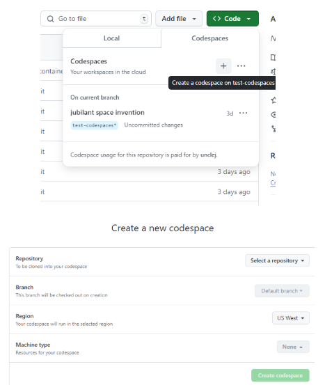

To do this follow these steps:

If this is not already in your `.devcontainer`, add the following directory to the root of your project: `.devcontainer` and add a new file `devcontainer.json` to this folder with the following:

```json
{
    "name": "Java Swing Development",
    "image": "mcr.microsoft.com/devcontainers/java:17",
    "features": {
        "ghcr.io/devcontainers/features/desktop-lite:1": {
            "password": "vscode"
        }
    },
    "forwardPorts": [
        6080
    ],
    "portsAttributes": {
        "6080": {
            "label": "Desktop (Web)"
        }
    }
}
```

Restart your codespace - you can do this with the directions in the help table on how to "Rebuild codespace".

After it restarts you should be able to go to the "ports" section and click the globe (open in browser).

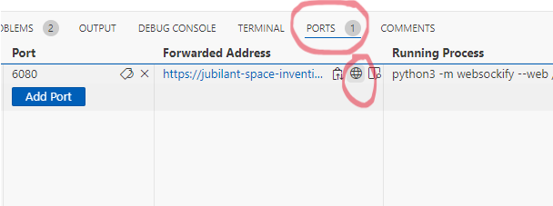

This should open up a browser tab to connect to VNC. 

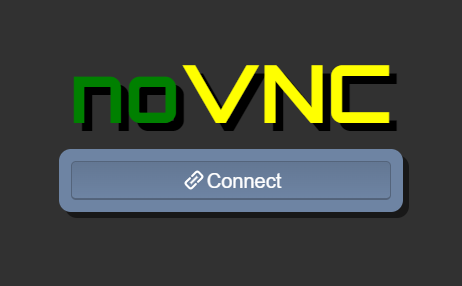

Click connect and you should now be able to run your GUI application from codespaces and have it come up in there.

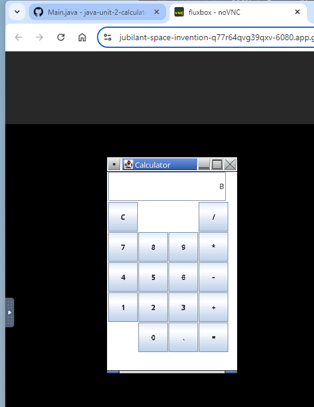



